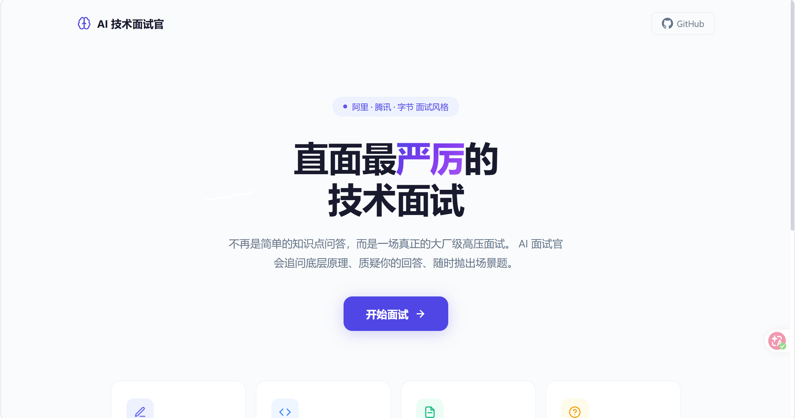
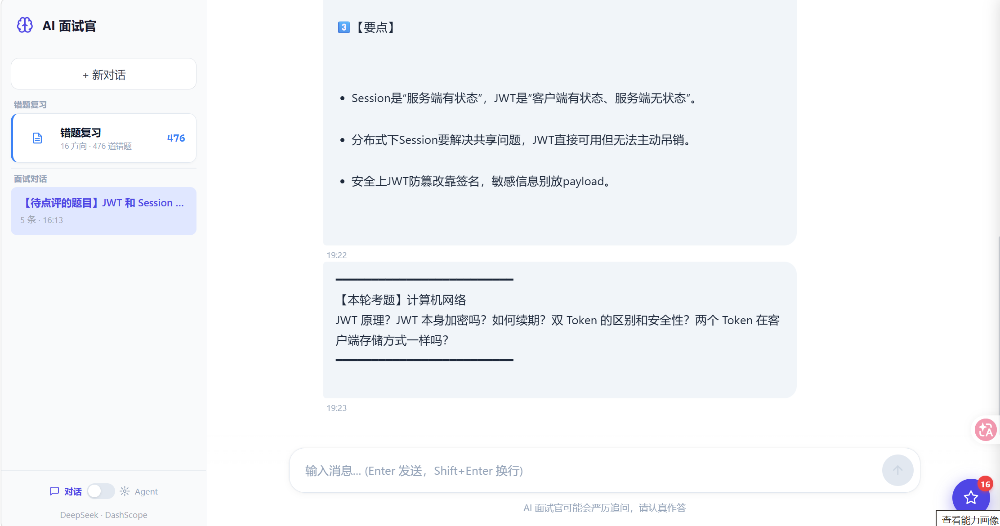
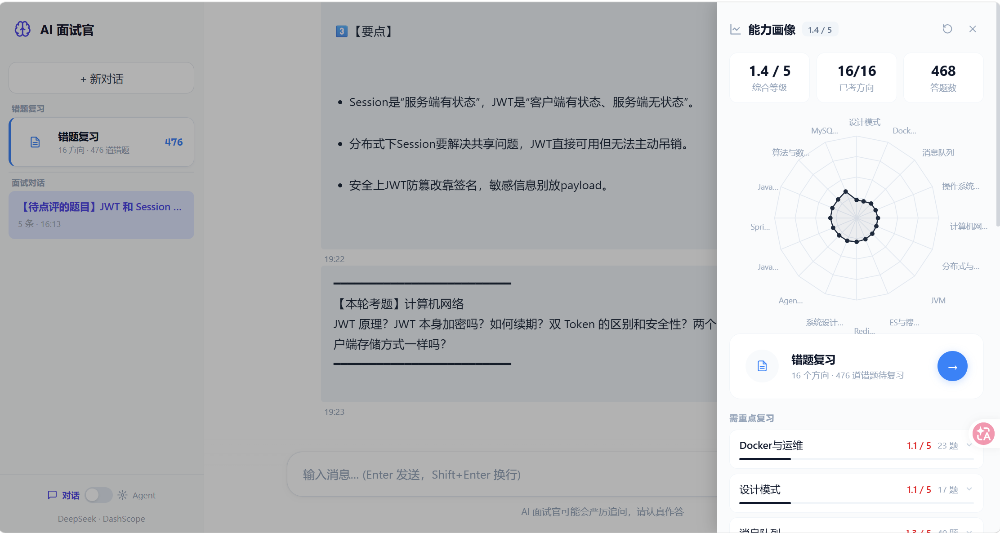

# AI 技术面试官

> 大厂级、高压、批判性的 AI 技术面试陪练。不再是「知识点问答」，而是一场会追问底层原理、质疑你的回答、随时抛出场景题的真实面试。


---

## 项目介绍

**AI 技术面试官** 是一个基于大模型打造的 AI 面试陪练应用，模拟阿里、腾讯、字节等大厂的真实高压面试风格。它会：

- 🔍 **源码级追问** —— 不满足于「会用」，追问 AQS 实现、Bean 生命周期、JVM 内存屏障等底层细节
- ⚡ **实时出题** —— 随时中断追问，抛出高难度代码题与系统设计题
- 📊 **面试评分** —— 面试结束给出综合评分与详细改进清单，定位每个知识薄弱点
- 🎭 **批判性审视** —— 对每个回答追问「为什么这样设计」「有没有更好方案」「生产环境会踩什么坑」

考察范围覆盖 Java 并发编程、synchronized 原理、AQS 框架、线程池调优、Spring IoC/AOP、Bean 生命周期、事务源码、JVM 调优、GC 算法、数据结构、系统设计、分布式架构等方向。

## 界面预览

### 首页

面试风格与考察范围一目了然，点击「开始面试」即可进入高压面试。



### 面试对话

AI 面试官实时追问、质疑与出题，支持 SSE 流式输出，沉浸式还原真实面试节奏。



### 能力画像

面试结束后生成能力画像，以雷达图展示各技术方向掌握情况，给出综合等级与改进建议。



## 核心功能

- 💬 **多轮对话面试** —— 基于对话记忆持久化，面试官记得你的每一句回答
- 🎯 **能力画像** —— 雷达图 + 综合等级，覆盖 16 个技术方向，随答题实时更新
- 📚 **复习模式** —— 针对薄弱知识点回顾复习，进度持久化保存
- 🛠 **工具调用 / MCP** —— 面试中可调用联网搜索等工具，回答更具事实依据
- 🔐 **用户体系** —— 注册 / 登录，个人面试进度与能力画像独立保存

## 技术栈

### 后端

- Java 21 + Spring Boot 3.4
- Spring AI（含 Spring AI Alibaba / LangChain4j）
- DeepSeek + 阿里百炼 DashScope（Qwen）
- PostgreSQL + PGVector 向量检索、Redis
- SSE 流式输出、MCP 模型上下文协议
- Kryo 序列化、Jsoup 网页抓取、iText PDF 生成

### 前端

- Vue 3 + Vite
- Vue Router、Axios
- marked（Markdown 渲染）、DOMPurify、Lucide 图标
- SSE 客户端流式接收

### 部署

- Docker / Docker Compose，支持本地与生产环境配置

## 快速开始

### 环境要求

- JDK 21+
- Node.js 16+ / npm 7+
- PostgreSQL（含 PGVector 扩展）与 Redis

### 1. 配置环境变量

复制 `.env.template` 为 `.env`，填入 DeepSeek 与 DashScope（百炼）的 API Key 等信息。

### 2. 启动后端

```bash
./mvnw spring-boot:run
```

后端默认运行在 `http://localhost:8123`。

### 3. 启动前端

```bash
cd qian-ai-agent-frontend
npm install
npm run dev
```

前端开发服务器默认运行在 `http://localhost:5173`，访问首页即可注册 / 登录并开始面试。

### 4. Docker 部署

```bash
docker compose up -d
```

## 项目结构

```
qian-ai-agent/
├── src/                        # 后端源码（Spring Boot）
│   └── main/java/com/qian/qianaiagent/
├── qian-ai-agent-frontend/     # 前端源码（Vue 3 + Vite）
├── qian-image-search-mcp-server/  # 图片搜索 MCP 服务
├── docker-compose.yml          # 本地编排
├── docker-compose.prod.yml     # 生产编排
└── .env.template               # 环境变量模板
```

## 致谢

本项目基于 [yu-ai-agent](https://github.com/liyupi/yu-ai-agent)（程序员鱼皮的 AI 智能体项目）二次开发而来，在其 Spring AI / ReAct Agent / MCP 技术基础上重构为 AI 技术面试官场景。感谢原作者的优质教程与开源分享。
